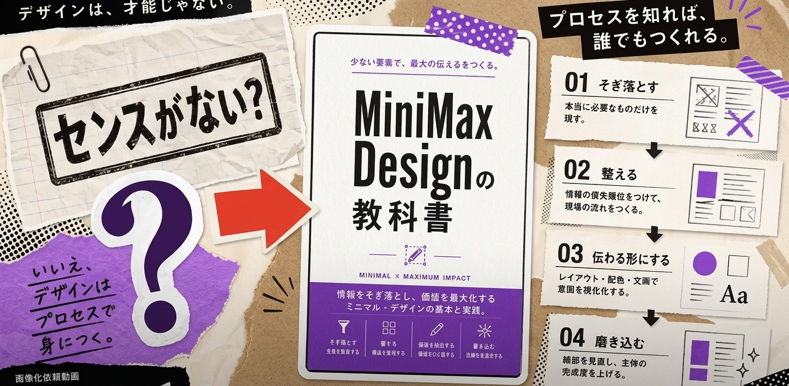

# 🚀 MiniMax Design Desktop

**MiniMax Design Desktop** is an autonomous multimodal AI platform and desktop agent for the full cycle of commercial media and video content creation. The application combines video generation, image creation, voiceovers, and music production into a single end-to-end pipeline controlled by simple text prompts and references.

  

---

## 🌟 Why Choose MiniMax Design?

The traditional process of creating AI video and commercial clips requires constantly switching between dozens of services (Midjourney, Runway, ElevenLabs, Suno, Adobe Premiere). **MiniMax Design** solves this problem by offering a conceptually new approach — an **autonomous multimodal producer**.

### 1. 🤖 Multi-Model Orchestration in One Window

You no longer need to subscribe to dozens of different platforms. MiniMax Design unifies leading AI models under a single interface:

* **Video Models:** The flagship **MiniMax H3 Omni**, as well as integrations with **Veo**, **Kling**, **Wan**, and **Seedance**. You can switch models on the fly and compare results within a single scene.
* **Speech and Audio Generation:** **MiniMax Speech 2.8** (expressive voiceovers with emotional nuance) and **MiniMax Music 3.0** (full soundtracks and vocal parts).
* **Images:** **GPT Image 2**, **Google Nano Banana Pro**, and a proprietary style reference generator.

### 2. 🎬 Autonomous AI Agent (End-to-End Workflow)

You don't need to write complex, heavily structured prompts. Describe your task in plain language (e.g., *"Create a 15-second promotional clip for sneakers with dynamic music and an athletic voiceover"*). The MiniMax Design agent:

* Breaks down the idea into a storyboard and script.
* Selects camera movements, composition, style, and shot dynamics.
* Automatically generates visuals, synthesizes voice, and overlays the background audio track.

### 3. ⚙️ Built-In Integration with ComfyUI and Node Pipelines

For professional motion designers and creators, a **ComfyUI Workflows** section is available:

* Pre-built template maps for MiniMax H3 (Text-to-Video, First/Last Frame transition, Multi-Reference, Reference-Video motion transfer).
* Ability to import custom `.json` ComfyUI schemes and use them without manually assembling complex node graphs.

### 4. 🖼️ Flexible Multi-Input System

Create content with maximum brand book adherence:

* **Text, Photo, Audio, and Video References:** Upload logos, product shapes, source audio recordings, or motion examples from other videos.
* **Consistency Retention:** The model precisely preserves product geometry, character identity, style, and motion direction across frames.

### 5. ✂️ Iterative Editing and Fine-Tuning

* **Variant Comparison:** Generate multiple options for a single scene across different models (e.g., H3 vs Kling) and pick the best one.
* **Natural Language Corrections:** Adjust camera trajectories, lighting, or speed directly in the chat without regenerating the entire project from scratch.
* **Final Assembly:** Configure subtitles, timing, and framing before export.

### 6. 💻 Local Workspace + Cloud Compute

* **Security and Organization:** All source files, text notes, and references are stored locally on your PC.
* **No GPU Load:** Heavy rendering and generation take place on MiniMax's powerful cloud servers, allowing comfortable work even on standard laptops.

---

## 💻 System Requirements

| Parameter | Minimum Requirements | Recommended Requirements |
| --- | --- | --- |
| **OS (Windows)** | Windows 10 (64-bit) | Windows 11 (64-bit) |
| **OS (macOS)** | macOS 11.0 (Big Sur) | macOS 13.0 (Ventura) or newer |
| **Processor** | Intel Core i5 / AMD Ryzen 5 / Apple M1 | Intel Core i7+ / Apple M2/M3/M4 |
| **RAM** | 8 GB RAM | 16 GB RAM or more |
| **Disk Space** | 500 MB free space | 2 GB free space (for project cache) |
| **Network** | Stable Internet connection (10+ Mbps) | High-speed Internet (50+ Mbps) |

---

## 📥 Installing the Desktop Client

You can download official installation files from the **[Releases](../../releases)** page.

### 🪟 Instructions for Windows (`.exe`)

1. **Download:**
Download the latest installer version: `MiniMax-Design-x64.7z`.
2. **Installation:**
Double-click the downloaded `.exe` file to launch the setup wizard.
3. **Bypassing Windows SmartScreen (if a prompt appears):**
* If Windows displays a *"Windows protected your PC"* window, click **"More info"**.
* Then click the **"Run anyway"** button.
4. **Completion:**
Follow the installer prompts, choose an installation folder, and wait for the process to complete. A desktop shortcut will appear.

---

### 🍏 Instructions for macOS (`.dmg`)

1. **Download:**
Download `MiniMax-Design-v2.5.0.dmg` (universal installer for Apple Silicon M1/M2/M3/M4 and Intel processors).
2. **Installation:**
* Open the downloaded `.dmg` image.
* In the window that appears, drag the **MiniMax Design** icon into your **Applications** folder.

3. **Bypassing macOS Protection (Gatekeeper / Unidentified Developer):**
* If a message appears stating *"App cannot be opened because it is from an unidentified developer"*:
1. Go to **System Settings** -> **Privacy & Security**.
2. Scroll down to the **Security** section.
3. Find the message regarding the blocked MiniMax Design launch and click **"Open Anyway"**.
4. Enter your administrator password or confirm via Touch ID.

* *Alternative method:* Right-click (or Control-click) the MiniMax Design icon in the Applications folder, select **"Open"**, and confirm launch in the dialog box.

---

## 🚀 Quick Start

1. **App Authorization:**
* Launch MiniMax Design Desktop.
* Log in via your **MiniMax / Hailuo AI** account or enter your **API Key**.

2. **Create Your First Project:**
* Click the **"New Project"** button.
* Select a mode: **Text to Video**, **Image to Video**, or **Full Creative Agent**.

3. **Formulate Your Request:**
* Describe your desired scene in the prompt field, and upload image or style references.
* Choose the target model (e.g., *MiniMax H3 Omni* for photorealism or *Kling* for stylized animation).

4. **Generate and Export:**
* Click **Generate** to start creating your assets.
* Use the built-in timeline and prompt correction tools to refine the output.
* Click **Export** to save your video in MP4 format (up to 4K, 60 FPS).

---

## ❓ Frequently Asked Questions (FAQ)

<b>Does MiniMax Design require a high-end local GPU (e.g., NVIDIA RTX)?</b>

No. All heavy AI rendering and model inference take place on MiniMax's cloud infrastructure. The desktop client serves as a lightweight workspace, meaning you can comfortably run the app on standard laptops or older machines without VRAM constraints.

<b>Are my uploaded brand assets and prompts used to train public AI models?</b>

No. Your local project files, brand assets, and references remain private. Cloud processing is strictly used to execute your generation requests. On paid plans (Starter, Plus, Pro), your inputs and generated outputs are never used to train or fine-tune public foundation models.

<b>Can I export individual project stems (separate video, voiceover, and music tracks)?</b>

Yes. In addition to exporting a fully rendered final MP4 video, you can export separate layers: raw video clips, WAV/MP3 audio stems (voiceover, background music, sound effects), and SRT/VTT subtitle files for further editing in Premiere Pro, Final Cut, or DaVinci Resolve.

<b>How are credits charged if a generation fails or requires minor tweaks?</b>

Credits are deducted only upon successful completion of a render. If a generation fails due to a network or server error, your credits are automatically refunded. Additionally, low-resolution draft previews and minor text edits consume a fraction of standard render credits.

<b>Do I hold full commercial ownership over all generated media?</b>

Yes. Active subscribers on any paid tier own full commercial rights to all generated video clips, images, voiceovers, and music tracks. You can freely monetize them across social media, client projects, paid advertising, and broadcast media without royalty fees or required attribution.

---

## 📄 License

* **License:** Proprietary Software (MiniMax AI).
